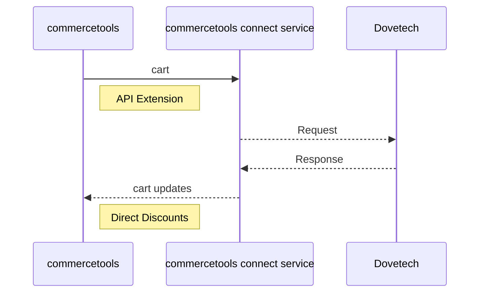

# Dovetech commercetools Connector

## Overview

This project provides a commercetools connector to integrate the Dovetech discounts and loyalty solution into commercetools.

An API extension is used (see [API Extensions](https://docs.commercetools.com/api/projects/api-extensions)) to pass carts and orders to the Dovetech Processor API and apply any discounts returned to the commercetools cart using Direct Discounts. See [Direct Discounts](https://docs.commercetools.com/api/pricing-and-discounts-overview#direct-discounts) for more details.

The diagram below provides an overview of the integration.

When a cart is converted to an order, the same flow occurs but the Dovetech service is called in commit mode. This will mark coupon codes as used etc.

This process checks to ensure the total order price hasn't changed (e.g. discounts have expired). If it has changed between the last evaluation of the cart and converting to an order, an error with code `InvalidOperation` will be returned.

## Additional Discount Features Dovetech Supports

- Earning loyalty points on purchases and redeeming loyalty points by applying discounts to carts
- Easily generate coupon codes within the tooling without having to generate files
- Coupon codes are assigned to groups and groups can be used as conditions in discounts. You can easily generate more codes in a group.
- Amount off and Fixed price Multibuy discounts
- Fixed price shipping discounts
- Drag and drop ranking of discounts
- Create reusable complex expressions that can be used across multiple discounts

## Prerequisites

1. Dovetech [account](https://dovetech.com/starter-sign-up) and Processor API Key
2. commercetools composable commerce [account](https://commercetools.com/free-trial)

## Installing the connector

Firstly, you'll need a commercetools API client with the `manage_extensions` and `manage_types` permissions.

To install the connector you will need to provide the following configuration settings:

- `DOVETECH_API_HOST` - this is available on the Details tab of the Dovetech Customer Portal
- `DOVETECH_API_KEY` - this is the Processor API Key from your project in the Dovetech Customer Portal
- The commercetools settings prefixed with `CTP_` should be populated from the API client created above
- `BASIC_AUTH_PASSWORD` - these two variables (current/previous) will allow the connector to validate that calls come from commercetools. `BASIC_AUTH_PASSWORD_CURRENT` is required, and has a minimum length of two characters and a maximum of 50.
- Optional - The `OTEL_EXPORTER_OTLP_ENDPOINT` and `OTEL_EXPORTER_OTLP_ENDPOINT_API_KEY` variables can be used for Production scenarios - they enable the Connect service application logs to be sent to Dovetech's external monitoring systems, giving Dovetech Tech Support visibility of runtime logging
- Optional - set any custom mapping rules in `MAPPING_CONFIGURATION` (see the Custom Mapping section below for more details)

As part of the deployment, the `connector:post-deploy` command will be called. This will create the API Extension in commercetools.

## Uninstalling the connector

When you uninstall the connector deployment the `connector:pre-undeploy` command will be called. This will remove the API extension.

## Demo

For an example of using the connector, see the [demo repo](https://github.com/dove-technology/commercetools-campaigns-connector-demo).

## Coupon Codes

See the [Coupon Codes](https://github.com/dove-technology/commercetools-campaigns-connector-demo?tab=readme-ov-file#coupon-codes) section of the demo readme for more information on how to use coupon codes.

## Error Handling

Just like in any system errors can occur when calling external services.

To try and ensure any unexpected errors don't impact a customer's experience, this connector service doesn't return errors back to commercetools for cart changes. The errors are logged, but no actions are returned from the service. This is to try and avoid errors impacting things like add to cart. In this scenario any discounts on the cart will not be updated.

When an order is being placed, we retry any failed requests to the Dovetech Processor API. If the error persists, an error is returned from the connector service and placing the order will fail. This is to ensure consistency in the order process.

## Limitations

### Carts with Multiple Shipping Methods

Carts with multiple Shipping Methods (i.e. carts with a Shipping Mode of `Multiple`) do not have their shipping cost passed to Dovetech so no shipping discounts setup in Dovetech will apply.

### Frozen Carts

[Frozen carts](https://docs.commercetools.com/api/carts-orders-overview#frozen-carts) are not supported. This is due to the fact that Direct Discounts don't apply to frozen carts. If you freeze a cart that has Direct Discounts applied, the prices are no longer discounted (even though the Direct Discounts are still on the cart). If you unfreeze the cart, the prices will be discounted again.

## Running the Connector locally (as an API Extension)

- Set up a local .env file as per `.env.example`
- `cd` into the `cart-service` directory
- Run `yarn install`
- Run `yarn build`
- Run `yarn start` or `yarn start:dev` (for hotloading) to start the server
- Run `ngrok http 8080 --url <your-ngrok-domain-url>` to expose the server to the internet/commercetools
- Run `yarn connector:post-deploy` to create the API extension in commercetools (note, this won't create a Connect install in this particular situation)
- Run `yarn connector:pre-undeploy` to clean up the API extension in commercetools

## commercetools Cart to Dovetech Property Mapping

The following properties are mapped by default:

### Cart

| commercetools                                 | Dovetech                           |
| --------------------------------------------- | ---------------------------------- |
| `customerId`                                  | `customer.id`                      |
| `customerEmail`                               | `customer.email`                   |
| `customerGroup.id`                            | `customer.groupId`                 |
| `totalPrice.currencyCode`                     | `context.currencyCode`             |
| `billingAddress.country`                      | `billingAddress.countryCode`       |
| `shippingAddress.country`                     | `shippingAddress.countryCode`      |
| `shippingInfo.shippingMethod.id`              | `shipping.methodId`                |
| `shippingInfo.price`                          | `costs` entry with name `Shipping` |
| `dovetech-discounts-couponCodes` custom field | `couponCodes`                      |

### Cart Line Items

| commercetools      | Dovetech                                                                                                                                                   |
| ------------------ | ---------------------------------------------------------------------------------------------------------------------------------------------------------- |
| `quantity`         | `quantity`                                                                                                                                                 |
| `price`            | `price.discounted` is used if it's set (due to a Product Discount) otherwise `price.value` is used. Value is converted from minor units to currency units. |
| `price.discounted` | `hasProductDiscount` (set if `price.discounted` has a value)                                                                                               |
| `productId`        | `productId`                                                                                                                                                |
| `productKey`       | `productKey`                                                                                                                                               |
| `productType.id`   | `productTypeId`                                                                                                                                            |
| `variant.key`      | `variant.key`                                                                                                                                              |
| `variant.sku`      | `variant.sku`                                                                                                                                              |

## Custom Mapping

You can customise this mapping process using the `MAPPING_CONFIGURATION` environment variable. We use the `object-mapper` library to do this mapping.
The `MAPPING_CONFIGURATION` environment variable needs to contain a JSON serialised version of the mapping configuration.

For example if you want to map a custom field on a cart called `test-field` to a property on the Dovetech request called `context.test` you would use the following configuration:

`{ "custom.fields.test-field": "context.test" }`

You can also map array values. So if you wanted to map the UK english `name` property of each line item in the cart to a `name` property on the Dovetech line item you would use the following configuration:

`{ "lineItems[].name.en-GB": "basket.items[].name" }`

**Note, property names are case sensitive.**
