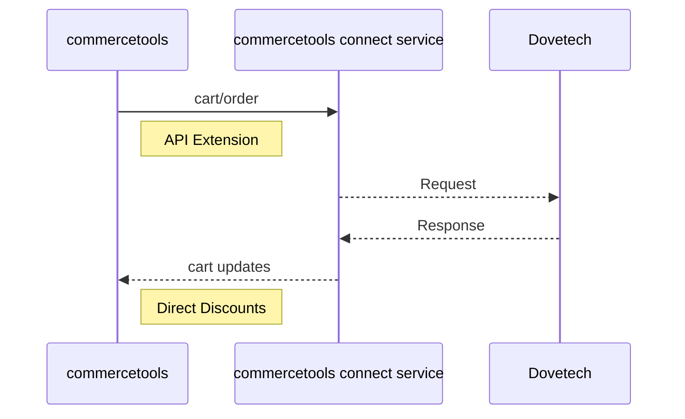

# Dovetech commercetools Connector

This project provides a commercetools connector to integrate the Dovetech discounts and loyalty solution into commercetools.

An API extension is used (see [API Extensions](https://docs.commercetools.com/api/projects/api-extensions)) to pass carts and orders to the Dovetech Processor API and apply any discounts returned to the commercetools cart using Direct Discounts. See [Direct Discounts](https://docs.commercetools.com/api/pricing-and-discounts-overview#direct-discounts) for more details.

## Carts with Multiple Shipping Methods

Carts with multiple Shipping Methods (i.e. carts with a Shipping Mode of `Multiple`) do not have their shipping cost passed to Dovetech so no shipping discounts setup in Dovetech will apply.

## Frozen Carts

[Frozen carts](https://docs.commercetools.com/api/carts-orders-overview#frozen-carts) are not supported. This is due to the fact that Direct Discounts don't apply to frozen carts. If you freeze a cart that has Direct Discounts applied, the prices are no longer discounted (even though the Direct Discounts are still on the cart). If you unfreeze the cart, the prices will be discounted again.

## Order Placement

When a cart is converted to an order the extension calls the Dovetech service in commit mode. This will mark coupon codes as used etc.

This process checks to ensure the total order price hasn't changed (e.g. discounts have expired). If it has changed between the last evaluation of the cart and converting to an order an error with code `InvalidOperation` will be returned.

## Running the Connector locally (as an API Extension)

- Set up a local .env file as per `.env.example`
- `cd` into the `cart-service` directory
- Run `yarn install`
- Run `yarn build`
- Run `yarn start` or `yarn start:dev` (for hotloading) to start the server
- Run `ngrok http 8080` to expose the server to the internet/commercetools
- Run `yarn connector:post-deploy` to create the API extension in commercetools (note, this won't create a Connect install in this particular situation)
- Run `yarn connector:pre-undeploy` to clean up the API extension in commercetools

## commercetools Cart to Dovetech Property Mapping

The following properties are mapped by default:

### Cart

| commercetools                                 | Dovetech                           |
| --------------------------------------------- | ---------------------------------- |
| `customerId`                                  | `customer.id`                      |
| `customerEmail`                               | `customer.email`                   |
| `customerGroup.id`                            | `customer.groupId`                 |
| `totalPrice.currencyCode`                     | `context.currencyCode`             |
| `billingAddress.country`                      | `billingAddress.countryCode`       |
| `shippingAddress.country`                     | `shippingAddress.countryCode`      |
| `shippingInfo.shippingMethod.id`              | `shipping.methodId`                |
| `shippingInfo.price`                          | `costs` entry with name `Shipping` |
| `dovetech-discounts-couponCodes` custom field | `couponCodes`                      |

### Cart Line Items

| commercetools      | Dovetech                                                                                                                                                   |
| ------------------ | ---------------------------------------------------------------------------------------------------------------------------------------------------------- |
| `quantity`         | `quantity`                                                                                                                                                 |
| `price`            | `price.discounted` is used if it's set (due to a Product Discount) otherwise `price.value` is used. Value is converted from minor units to currency units. |
| `price.discounted` | `hasProductDiscount` (set if `price.discounted` has a value)                                                                                               |
| `productId`        | `productId`                                                                                                                                                |
| `productKey`       | `productKey`                                                                                                                                               |
| `productType.id`   | `productTypeId`                                                                                                                                            |
| `variant.key`      | `variant.key`                                                                                                                                              |
| `variant.sku`      | `variant.sku`                                                                                                                                              |

## Custom Mapping

You can customise this mapping process using the `MAPPING_CONFIGURATION` environment variable. We use the `object-mapper` library to do this mapping.
The `MAPPING_CONFIGURATION` environment variable needs to contain a JSON serialised version of the mapping configuration.

For example if you want to map a custom field on a cart called `test-field` to a property on the Dovetech request called `context.test` you would use the following configuration:

`{ "custom.fields.test-field": "context.test" }`

You can also map array values. So if you wanted to map the UK english `name` property of each line item in the cart to a `name` property on the Dovetech line item you would use the following configuration:

`{ "lineItems[].name.en-GB": "basket.items[].name" }`

**Note, property names are case sensitive.**

## Additional Discount Features Dovetech Supports

- Earning loyalty points on purchases and redeeming loyalty points by applying discounts to carts
- Easily generate coupon codes within the tooling without having to generate files
- Coupon codes are assigned to groups and groups can be used as conditions in discounts. You can easily generate more codes in a group.
- Amount off and Fixed price Multibuy discounts
- Fixed price shipping discounts
- Drag and drop ranking of discounts
- Create reusable complex expressions that can be used across multiple discounts

